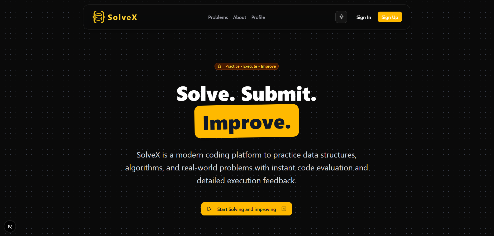

# 🚀 Solvex - Modern Coding Platform

Solvex is a high-performance, feature-rich coding platform designed for developers to practice, solve, and create programming problems. Built with a modern tech stack, it provides a seamless interactive coding experience with real-time code execution, submission history, and a premium developer UI.



## ✨ Features

- **💻 Advanced Code Editor**: Integrated Monaco Editor (the power behind VS Code) for a premium coding experience.
- **⚡ Real-time Execution**: Instant code execution and test case validation via Judge0 API.
- **🤖 High-Speed AI Assistance**: Powered by **Groq (llama-3.1-8b-instant)** for real-time tutoring and complexity reviews.
- **🧑‍🏫 Socratic AI Coding Tutor**: A sidebar drawer component that provides pedagogical hints and guidance on editor code without spoiling the answer.
- **🔍 AI Complexity Auditor & Reviewer**: Locks until all test cases pass, then performs O(f(N)) time/space complexity analysis and suggests optimized refactored solutions.
- **🔐 Secure Authentication**: Robust user management and social login powered by Clerk.
- **📊 Progress Tracking**: Detailed submission history and problem-solving statistics.
- **🛠️ Problem Creator**: Tools for admins and users to create and manage custom coding challenges with tag/category dropdowns.
- **📂 Playlists & Collections**: Organize problems into curated lists for structured learning.
- **🎨 Premium UI/UX**: Modern, responsive design built with Tailwind CSS 4 and Radix UI primitives.

## 🛠️ Tech Stack

- **Framework**: [Next.js](https://nextjs.org/) (App Router)
- **Database**: [PostgreSQL](https://postgresql.org/) (Hosted on [Neon](https://neon.tech/))
- **ORM**: [Prisma](https://prisma.io/)
- **Authentication**: [Clerk](https://clerk.com/)
- **Code Execution**: [Judge0](https://ce.judge0.com/)
- **Editor**: [Monaco Editor](https://microsoft.github.io/monaco-editor/)
- **Styling**: [Tailwind CSS 4](https://tailwindcss.com/), [Shadcn UI](https://ui.shadcn.com/)
- **Icons**: [Lucide React](https://lucide.dev/)

## 🚀 Getting Started

### Prerequisites

- Node.js 18+ 
- A Neon Database account
- A Clerk account
- Judge0 API endpoint

### 1. Clone the repository
```bash
git clone https://github.com/yourusername/solvex.git
cd solvex
```

### 2. Install dependencies
```bash
npm install
```

### 3. Setup Environment Variables
Create a `.env` file in the root directory and add the following:

```env
DATABASE_URL="your_neon_connection_string"

NEXT_PUBLIC_CLERK_PUBLISHABLE_KEY=your_clerk_pub_key
CLERK_SECRET_KEY=your_clerk_secret_key

NEXT_PUBLIC_CLERK_SIGN_IN_URL=/sign-in
NEXT_PUBLIC_CLERK_SIGN_UP_URL=/sign-up

JUDGE0_API_URL=https://ce.judge0.com

# Groq API Configuration (for AI features)
GROQ_API_KEY=your_groq_api_key
```

### 4. Database Setup
Sync your schema with the database:
```bash
npx prisma db push
npx prisma generate
```

### 5. Run the development server
```bash
npm run dev
```

Open [http://localhost:3000](http://localhost:3000) with your browser to see the result.

## 📦 Deployment

The project is optimized for deployment on **Vercel**.

1. Push your code to a GitHub repository.
2. Create a new project on Vercel and link your repository.
3. Add your environment variables in the Vercel project settings.
4. Vercel will automatically run `npm run build`, which includes `prisma generate`.

## 🤝 Contributing

Contributions are welcome! Please feel free to submit a Pull Request.

## 📄 License

This project is licensed under the MIT License - see the [LICENSE](LICENSE) file for details.

---
Built with ❤️ by [Dhiman Majumdar](https://github.com/DhimanMajumdar)
